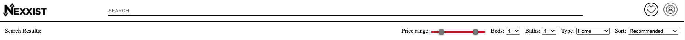
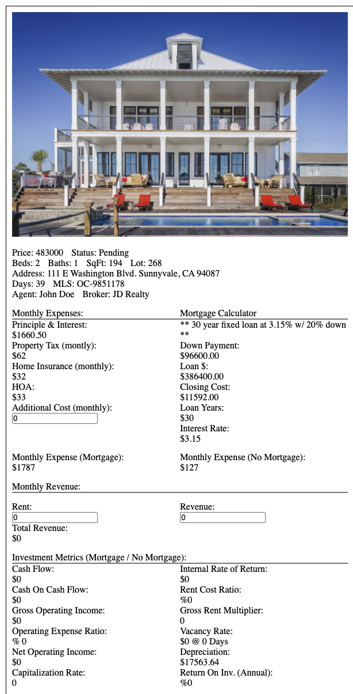

# NEXXIST

Nexxist is an application that is going to chage how people find real estate investment properties that are great investment properties. It is an open and public mls that will track and load property details as well as important investing metrics that are calculated with each home

current deployment version: 1.0.0

Nexxist consist of two different main sections in the current version:

Future Changes -
    -Link to Zillow Api
    -Allow city, zip-code, and address search
    -Render existing homes
    -Additional styling
    -Functioning filters and sorting
    -Account creation
    -Property Favoriting

Header section:

The header section functionality will be added in the next update.
The header section will allow the users to complete a variety of tasks including
    -filter price, beds, baths, and property type 
    -sort results
    -input a search of address, zip-code, and city to get all the properties in a specific area
    -create a profile and save your searches as well as favorites

The main portion of Nexxist consist of the property card which you can see above. This will take data from Zillow and for each property, generate a block. This block will hold property details, general information, and calculate investment metrics that are key to finding the perfect real estate investment opportunity.

Property Details:
    -price
    -status
    -beds
    -baths
    -square feet
    -lot
    -address
    -days listed
    -mls id 
    -agent
    -broker

General information:
    -principle and interest
        -this will be automatically generated based on default loan parameters. A traditional loan for a home consist of 20% down payment, 30 years, and an interest rate of 3.15%
    -Property Tax
        -this is the current amount of property tax and the owner will pay every year. It is currently based on California Property Tax Rate.
    -Home Insurance
        -this is the current amount of home insurance the owner will pay every year. It is currently based on California Property Tax Rate.
    -HOA
        -if a property has an hoa monthly payment, it is added here and will contribute to the overall expenses every month
    -Additional Cost:
        -this is where the owner can input any additional costs every month that they expect to pay on the property in order to accurately calculate the investment metrics
    
Revenue:
    -Rent
        - This is where the user can input how much they are expecting to chage every month on rent. It will dynamically chagne the investment metrics to reflect the most updated metrics
    -Revenue
        -these are any additional revenue that is generated with the proerty outside of the rent to correctly calculate investment metrics

Investment Metrics:
    ** this section is where a user can immediately see some of the most important statistics when it comes to investing before they purchase a property **
    ** Some metrics will calculate and display 2 statistics. One if the buyer has a mortgage and the other if the buyer pays for the property in full **
    -Cash Flow
    -Cash on Cash return
    -Gross Operating Income
    -Operating Expense Ratio
    -Net Operating Income
    -Captialization Rate
    -Internal Rate of Return
    -Rent Cost Ratio
    -Gross Rent Multiplier
    -Vacancy Rate
    -Depreciation
    -Return On Inv.
